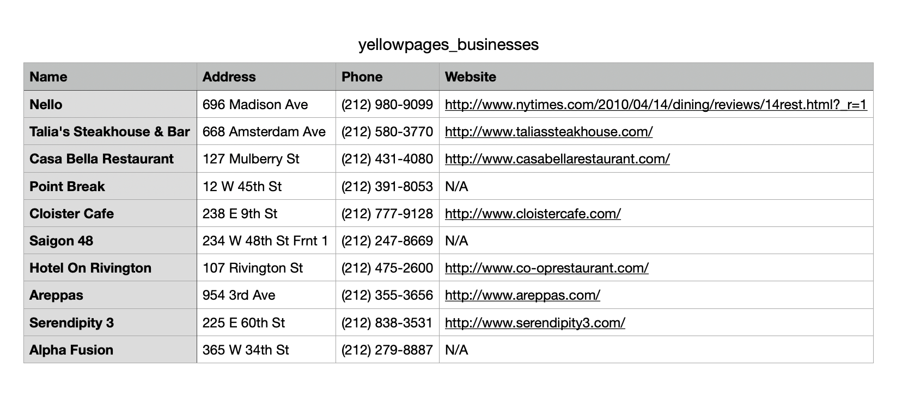

# Yellow Pages Business Scraper

This project scrapes business listings from Yellow Pages, extracting names, addresses, phone numbers, and websites. It uses Python with `selenium` to handle dynamically loaded content.

## How to Run

1. **Clone the repository**:

   git clone https://github.com/udayag/YellowPagesScraper.git

2. **Install the required libraries**:

   pip install selenium

3. **Install ChromeDriver**:
- Download ChromeDriver matching your Chrome version from [Chrome for Testing](https://googlechromelabs.github.io/chrome-for-testing/).
- Move it to `/usr/local/bin/` (or update the `CHROMEDRIVER_PATH` in the script).

4. **Run the scraper**:

   python yellowpages_scraper.py

5. **Check the output**:
- The scraped data will be saved in `yellowpages_businesses.csv`.

## Output Example

Name,Address,Phone,Website
Nello,696 Madison Ave,(212) 980-9099,http://www.nytimes.com/2010/04/14/dining/reviews/14rest.html?_r=1
Talia's Steakhouse & Bar,668 Amsterdam Ave,(212) 580-3770,http://www.taliassteakhouse.com/
Casa Bella Restaurant,127 Mulberry St,(212) 431-4080,http://www.casabellarestaurant.com/
Point Break,12 W 45th St,(212) 391-8053,N/A
Cloister Cafe,238 E 9th St,(212) 777-9128,http://www.cloistercafe.com/
Saigon 48,234 W 48th St Frnt 1,(212) 247-8669,N/A
Hotel On Rivington,107 Rivington St,(212) 475-2600,http://www.co-oprestaurant.com/
Areppas,954 3rd Ave,(212) 355-3656,http://www.areppas.com/
Serendipity 3,225 E 60th St,(212) 838-3531,http://www.serendipity3.com/
Alpha Fusion,365 W 34th St,(212) 279-8887,N/A


## Notes

- This script runs in **non-headless mode** due to compatibility issues with ChromeDriver on macOS arm64 systems. To run in headless mode, you may need to adjust ChromeDriver settings or use a different system.
- Always check Yellow Pages' **terms of service** before scraping.

